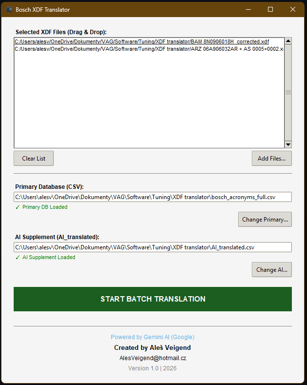
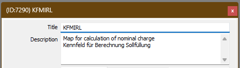

Bosch XDF Translator is a powerful automation tool designed for automotive tuners working with TunerPro. It automatically translates  Bosch acronyms and German technical terms in XDF files into clear, readable descriptions using a custom database and AI-supplemented translations.

Key Features
- Batch Processing: Translate multiple XDF files at once.
- Drag & Drop Support: Simply drag your XDF files into the application window.
- Dual-Database Matching: Uses a primary professional database and an AI-translated supplement for maximum coverage.
- Non-Destructive: Keeps original descriptions while adding translated text for better context.
- Legacy & XML Support: Works with both old-format and modern XML-based XDF files.
- Missing Terms Report: Automatically generates a list of untranslated terms for further database refinement.

How to Use
- Select Databases: Ensure your bosch_acronyms.csv and ai_translated.csv are in the same folder as the application (they will load automatically).
- Add XDFs: Drag and drop your XDF files or use the "Add Files" button.
- Translate: Hit "START BATCH TRANSLATION". The translated files will be created with a _translated suffix.
- Check Reports: If some terms were missing, check missing_descriptions.txt to see what needs adding to your CSV.

